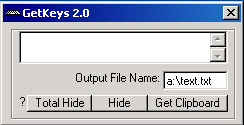



## GetKeys 2\.0

### Description

This logs texted that is typed. It is hidden from alt+ctrl Delete. It can be hidden to the toolbar as a icon. Or it can be totally hidden. If you like it leave comments or vote.
 
### More Info
 
If it is 'totally' hidden and then you open another one and hide it again it will totally mess up the logging. I will try and find a way around that.

             |
---                |---
**Submitted On**   |2001-02-06 20:36:12
**By**             |[VBguy](https://github.com/Planet-Source-Code/PSCIndex/blob/master/ByAuthor/vbguy.md)
**Level**          |Intermediate
**User Rating**    |4.0 (8 globes from 2 users)
**Compatibility**  |VB 4\.0 \(16\-bit\), VB 4\.0 \(32\-bit\), VB 5\.0, VB 6\.0
**Category**       |[Coding Standards](https://github.com/Planet-Source-Code/PSCIndex/blob/master/ByCategory/coding-standards__1-43.md)
**World**          |[Visual Basic](https://github.com/Planet-Source-Code/PSCIndex/blob/master/ByWorld/visual-basic.md)
**Archive File**   |[CODE\_UPLOAD14628272001\.zip](https://github.com/Planet-Source-Code/vbguy-getkeys-2-0__1-15078/archive/master.zip)

